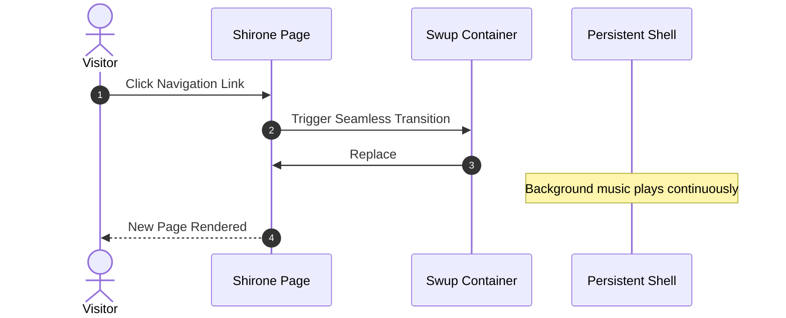

欢迎来到 **Shirone**（白音）——一个以 **Astro 7**、**Svelte 5** 与 **Material 3 Expressive（M3E）** 设计体系打造、富有表现力的动漫风格博客主题。

本指南将带你了解文章创建、frontmatter 规范、目录结构，以及一整套内置的 Markdown 与 MDX 扩展。

:::tip
Shirone 采用服务端优先（SSR-first）渲染。站内导航时，Swup 会无缝替换主容器，同时保留外层应用外壳与连续不断的音乐播放。
:::

---

## 1. 创建新文章

你可以借助内置 CLI 命令，快速生成一篇带有标准 frontmatter 的新文章：

```bash
# Create a single-file post
pnpm new-post my-first-post

# Or create a post in a sub-directory
pnpm new-post guides/getting-started
```

新建的文件会被放在 `src/content/posts/` 目录下。

---

## 2. Frontmatter 规范

每篇 Markdown（`.md`）或 MDX（`.mdx`）文章都以一段 YAML frontmatter 块开头，用于定义其元数据。

### 示例

```yaml
---
title: "Exploring Material 3 Expressive Design"
published: 2026-08-26
updated: 2026-08-27
publishedAt: 2026-08-26T10:00:00+08:00
updatedAt: 2026-08-27T09:30:00+08:00
pinned: true
description: "A deep dive into dynamic HCT color science and fluid transitions in Shirone."
image: "./cover.webp"
tags: [M3E, Design, Frontend]
category: Guides
draft: false
comment: true
---
```

### 支持的 frontmatter 字段

| 字段 | 类型 | 必填 | 说明 |
| :--- | :--- | :---: | :--- |
| `title` | `string` | **是** | 文章主标题。 |
| `published` | `Date` | **是** | 发布日期，格式为 `YYYY-MM-DD`。 |
| `publishedAt` | `Date` | 否 | 精确的发布时刻，用于对同一天发布的文章排序。该时刻在站点配置的时区中必须落在 `published` 当天。 |
| `updated` | `Date` | 否 | 最后更新日期。提供后会在文章页显示“有更新”提示徽标。 |
| `updatedAt` | `Date` | 否 | 供订阅源与机器可读元数据使用的精确更新时刻。必须与 `updated` 配对使用。 |
| `pinned` | `boolean` | 否 | 将文章置顶到文章列表顶部（默认：`false`）。 |
| `description` | `string` | 否 | 文章摘要，展示于文章卡片、搜索结果与 OpenGraph 元数据中。 |
| `image` | `string` | 否 | 封面图片路径。支持相对路径（`./cover.webp`）、public 目录路径（`/images/cover.jpg`）或远程 URL。 |
| `tags` | `string[]` | 否 | 标签名数组，用于分类筛选与标签云。 |
| `category` | `string` | 否 | 用于分类索引的主分类名。 |
| `draft` | `boolean` | 否 | 标记为草稿。草稿文章在生产构建（`pnpm build`）时会被隐藏。 |
| `comment` | `boolean` | 否 | 针对单篇文章切换评论区（默认：`true`）。 |
| `lang` | `string` | 否 | 语言代码（例如 `en`、`zh_CN`、`ja`），当与站点默认语言不同时使用。 |

---

## 3. 文章加密

Shirone 提供客户端文章加密。对于私人日志或受限文章，可在 frontmatter 中指定密码：

```yaml
---
title: "Private Research Notes"
published: 2026-08-26
encrypted: true
password: "your-secret-passphrase"
passwordHint: "Favorite anime character"
hideHomeContent: true
---
```

- `encrypted`：设为 `true` 以启用加密；
- `password`：解锁文章所需的密码短语（字符串或数字）；
- `passwordHint`：可选提示，显示在密码输入框上方；
- `hideHomeContent`：在首页隐藏字数统计与内容预览，防止信息泄露。

---

## 4. 组织文章文件

Shirone 同时支持文件夹式同目录存放与单文件两种布局：

### 文件夹结构（本地资源推荐）

将文章与其媒体资源放在同一目录，可让资源管理一目了然：

```text
src/content/posts/
├── my-great-post/
│   ├── index.md           <-- Post content
│   ├── cover.webp         <-- Cover image (image: "./cover.webp")
│   └── diagram.png        <-- Inline illustration referenced in markdown
```

### 单文件结构（轻量短文）

```text
src/content/posts/
├── hello-world.md
└── quick-thoughts.md
```

---

## 5. 丰富的 Markdown 与 MDX 扩展

Shirone 开箱即用地集成了现代化 Markdown 扩展：

### 5.1 Admonition 提示框

使用容器指令来书写注释、提示、警告与提醒：

```markdown
:::tip
Use admonition containers to highlight key takeaways or best practices.
:::

:::warning
Use warning containers to signal potential pitfalls or breaking changes.
:::
```

### 5.2 GitHub 仓库卡片

使用指令语法嵌入实时、样式精美的 GitHub 仓库卡片：

```markdown
::github{repo="LyraVoid/Shirone"}
```

::github{repo="LyraVoid/Shirone"}

### 5.3 Expressive Code 代码块

增强型代码块支持语法高亮、文件名徽标、行号与选择性高亮指定行：

```typescript title="src/utils/theme.ts" {2,4-5}
// Dynamic HCT color token derivation
import { argbFromHex, themeFromSourceColor } from "@material/material-color-utilities";

const theme = themeFromSourceColor(argbFromHex("#f472b6"));
console.log("Primary color token:", theme.schemes.light.primary);
```

### 5.4 数学排版（KaTeX）

在 Markdown 中直接渲染优雅的 LaTeX 数学记号：

- **行内公式**：$E = mc^2$ 或欧拉公式 $e^{i\pi} + 1 = 0$。
- **块级公式**：

$$
\int_{-\infty}^{\infty} e^{-x^2} \, dx = \sqrt{\pi}
$$

### 5.5 Mermaid 图表

用纯文本即可创建流程图、时序图与架构图：



### 5.6 图片画廊与 Fancybox 灯箱

图片会自动接入 Fancybox，支持无损缩放、拖动手势与全屏预览：

```markdown

```

---

## 6. 下一步与自定义

- **站点配置**：了解 `src/config/siteConfig.ts` 与 [`src/config/README.md`](/about/) 中的全局设置。
- **设计令牌**：在 `DESIGN.md` 与 `docs/m3e-standard.md` 中探索令牌与配色方案。
- **反馈与社区**：到 [GitHub Issues](https://github.com/LyraVoid/Shirone/issues) 分享你的想法与问题。
