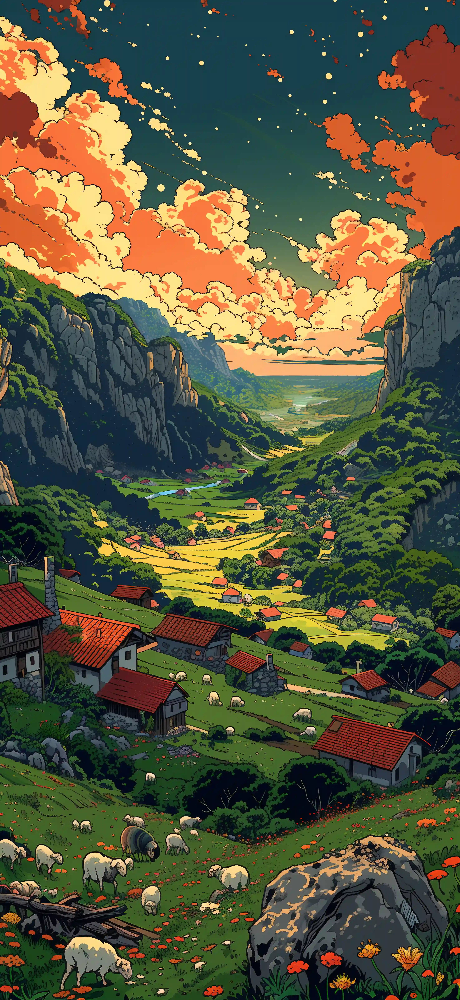

`:::grid` 是本博客的图片画廊容器指令。它会把普通的 Markdown 图片排布为统一宽高比的响应式网格，并自动启用灯箱预览。适合用于文章配图、截图、作品集或小型相册。

同一画廊中的图片使用相同的卡片比例。默认采用居中裁剪填满每张卡片，让每一行都保持整齐；点击图片即可在灯箱中查看完整原图。每个画廊拥有独立的灯箱分组，不会与文章中的其他图片混在一起。

> 本文既是功能文档，也是可视化测试页。请分别在桌面、平板与手机宽度下查看示例，再点击任意图片来验证灯箱分组行为。

## 最小语法

在 `:::grid` 与闭合的 `:::` 之间直接书写 Markdown 图片：

````markdown
:::grid


:::
````

每张图片必须独占一个段落，图片之间留空行。画廊中只放图片；段落、列表与代码块请写在容器之外。

以下是最小语法的效果。在不带任何参数时，网格默认使用三列、`16/10` 比例与 `cover` 模式。

:::grid


:::

## 参数速览

在开始指令之后用花括号书写全部参数：`:::grid{parameter="value"}`。

| 参数 | 允许的值 | 默认值 | 用途 |
| --- | --- | --- | --- |
| `columns` | 从 `1` 到 `6` 的整数 | `3` | 桌面端每行的列数。无效值会回退到 `3`。 |
| `aspect` | 正比例，例如 `16/9`、`3/4` 或 `1/1` | `16/10` | 卡片的显示比例，而非原图比例。 |
| `fit` | `cover`、`contain` | `cover` | 图片的适配模式。`cover` 会裁剪以填满卡片；`contain` 保留完整图片，可能会留下空白。 |

完整示例：

````markdown
:::grid{columns="3" aspect="16/9" fit="cover"}


:::
````

下面这个效果使用了上文的三列横图语法。请对比卡片比例、列数，以及标题优先于 alt 文本成为图注的规则：

:::grid{columns="3" aspect="16/9" fit="cover"}


:::

## 图注与 Alt 文本

图片的 alt 文本既是无障碍替代文本，也是默认的图注。当图片带有可选的 title（标题）时，则会改用 title 作为图注：

```markdown

```

同一行内，图注会与每张卡片的底部对齐。某条图注换行时，不会让其他卡片悬浮在参差不齐的高度上。类似 `3:4`、`16:9` 的比例文字可以直接写在正文、标题与 alt 文本中，无需转义。

本示例演示默认的 alt 文本图注、显式 title 图注，以及较长图注的底部对齐：

:::grid{columns="3" aspect="1/1"}


:::

## 布局与裁剪

桌面布局使用 `columns` 指定的列数。低于 `768px` 时，网格最多两列；低于 `480px` 时切换为一列。卡片容器固定 `aspect` 比例并裁切圆角，图片填满卡片，且不带主题默认的图片外边距。

- 选择 `cover`：这是推荐的默认模式。图片从中心向外裁剪以填满卡片，让画廊整体观感一致。
- 选择 `contain`：显示完整原图而不裁剪。当图片比例与卡片不同时，会露出主题背景；适合不能裁剪的图片。
- 若希望在无空白的情况下保留完整图片，可将 `aspect` 设为接近原图的比例，或把图片单独放进一个网格。

以下示例把同一组竖图分别放进 `cover` 与 `contain` 的 `16/9` 卡片中。前者对图片进行了裁剪；后者保留完整图片并留下背景空白。

````markdown
:::grid{columns="3" aspect="16/9" fit="cover"}


:::

:::grid{columns="3" aspect="16/9" fit="contain"}


:::
````

:::grid{columns="3" aspect="16/9" fit="cover"}


:::

:::grid{columns="3" aspect="16/9" fit="contain"}


:::

## 默认配置

不带任何属性时，默认使用三列、`16/10` 比例与 `cover` 裁剪。下面这三张竖图用于验证默认裁剪与图注。

````markdown
:::grid


:::
````

:::grid


:::

## 三列竖图：3:4

使用 `aspect="3/4"` 时，三张竖图会填满比例一致的竖向卡片。如果原图比例不同，`cover` 会从中心向外裁剪其边缘。

````markdown
:::grid{columns="3" aspect="3/4"}


:::
````

:::grid{columns="3" aspect="3/4"}


:::

## 三列横图：16:9

这组图片展示三列布局中常见的视频封面比例。当横图与卡片比例接近时，裁剪幅度最小。

````markdown
:::grid{columns="3" aspect="16/9"}


:::
````

:::grid{columns="3" aspect="16/9"}


:::

## 两列方形图：1:1

当需要更大的预览卡片时，两列布局效果很好。第三张图片会移到下一行。最后一行保持网格轨道的宽度，而不是拉伸图片去填满整行。

````markdown
:::grid{columns="2" aspect="1/1"}


:::
````

:::grid{columns="2" aspect="1/1"}


:::

## 四列加 `contain`

`fit="contain"` 不会裁剪原图。当图片比例与卡片比例不一致时，会露出主题背景。这是有意为之，并非布局问题。它同时验证了四列网格与相互独立的灯箱分组互不干扰。

````markdown
:::grid{columns="4" aspect="16/9" fit="contain"}


:::
````

:::grid{columns="4" aspect="16/9" fit="contain"}


:::

## 单列细节图

当图片需要更大的阅读尺寸时，单列布局更为合适。它无论在桌面、平板还是手机上始终保持单列，原图仍可在灯箱中查看。

````markdown
:::grid{columns="1" aspect="16/9"}

:::
````

:::grid{columns="1" aspect="16/9"}

:::

## 稀疏五列布局

五列用于验证更高的列数支持。当只有三张图片时，最后一行保持左对齐，而不会拉伸图片。

````markdown
:::grid{columns="5" aspect="1/1"}


:::
````

:::grid{columns="5" aspect="1/1"}


:::

## 六列混合图片

六列是目前支持的最大列数。横图与竖图混排，可以检验 `cover` 裁剪、窄卡片上的图注，以及高密度的桌面布局。对于追求可读性的文章内容，通常两到四列更合适。

````markdown
:::grid{columns="6" aspect="1/1"}


:::
````

:::grid{columns="6" aspect="1/1"}


:::

## 四列方形图：1:1

四张同比例的方形图是典型的四列布局。桌面端一行显示全部四张；平板端收为两列，移动端收为一列。

````markdown
:::grid{columns="4" aspect="1/1"}


:::
````

:::grid{columns="4" aspect="1/1"}


:::

## 六列横图：16:9

六列横图非常适合缩略图预览、作品集与截图索引。即便原图比例略有差异，`cover` 也能让每张 `16/9` 卡片保持一致的填满效果。

````markdown
:::grid{columns="6" aspect="16/9"}


:::
````

:::grid{columns="6" aspect="16/9"}


:::

## 三列竖图：3:4

这组六张竖图展示了人像、海报或手机截图的常见布局。图片排成两行三列，图注与底部对齐。

````markdown
:::grid{columns="3" aspect="3/4"}


:::
````

:::grid{columns="3" aspect="3/4"}


:::

## 边缘关键内容：`cover` 与灯箱

这些图片在靠近边缘处带有重要的文字或细节。`cover` 能保持网格整齐，但也可能裁掉这些边缘；点击图片即可在灯箱中查看未裁剪的原图。对边缘敏感的图片请使用清晰的图注，或改用下方的 `contain`。

````markdown
:::grid{columns="3" aspect="16/9" fit="cover"}


:::
````

:::grid{columns="3" aspect="16/9" fit="cover"}


:::

## 极端比例下的 `contain`

对于横幅、长截图及其他极端比例的图片，`contain` 会显示完整原图。与 `cover` 不同，它可能会露出主题背景，但绝不会裁剪内容。

````markdown
:::grid{columns="3" aspect="16/9" fit="contain"}


:::
````

:::grid{columns="3" aspect="16/9" fit="contain"}



:::

## 透明图片

透明图片会透出卡片的主题背景。这个单列 `contain` 示例便于观察透明区域、原图边缘与灯箱行为。

````markdown
:::grid{columns="1" aspect="16/9" fit="contain"}

:::
````

:::grid{columns="1" aspect="16/9" fit="contain"}

:::

## 灯箱导航

点击网格中的任意图片即可打开 Fancybox 灯箱。在灯箱中可以缩放、旋转、进入全屏、查看缩略图，并用方向键切换。导航范围仅限当前的 `:::grid` 容器：例如，点击 "16:9 test image one" 只会打开该小节中的另外两张横图。

同一篇文章中普通的 Markdown 图片仍会被单独处理，不会并入任何画廊网格。

## 检查清单

1. 每个网格中的图片尺寸一致，图注位于卡片下方。
2. 图片在悬停时会轻微缩放；点击后可用键盘进行缩放、旋转与切换。
3. 点击 "16:9 test image one" 后，灯箱只会浏览该小节中的另外两张横图。
4. 低于 `768px` 时网格最多两列；低于 `480px` 时为一列。
5. "Four Columns with `contain`" 小节中的竖图完整可见，留有空白且不裁剪。
6. 五列与六列网格在宽屏下保持指定的列数，随后按响应式规则收为两列或一列。
