Mermaid 能将 Markdown 中的文字描述转换为图表。下面的示例借助 Shirone 的内容工作流，展示了技术文章和项目笔记中常见的各类图表。

## 流程图

流程图用于描述某个过程，包括判断分支，以及回到上一步的路径。

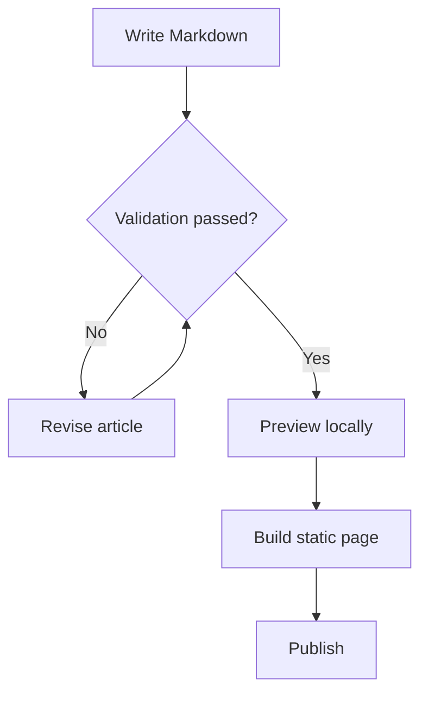

## 时序图

时序图按时间顺序展示参与者之间的协作。本示例跟踪了一次 Swup 页面导航，从发起请求到最终由 Mermaid 完成渲染。

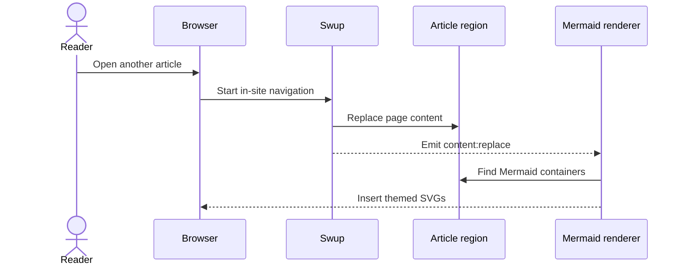

## 实体关系图

实体关系图用于为结构化数据建模，展示作者、文章、标签与评论之间的关联关系。

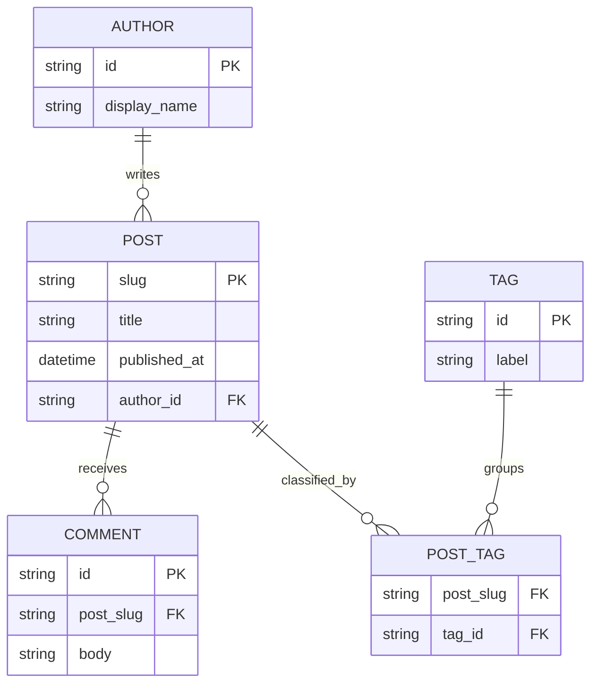

## 类图

类图用于表达软件设计中各类的职责、公开方法以及依赖方向。

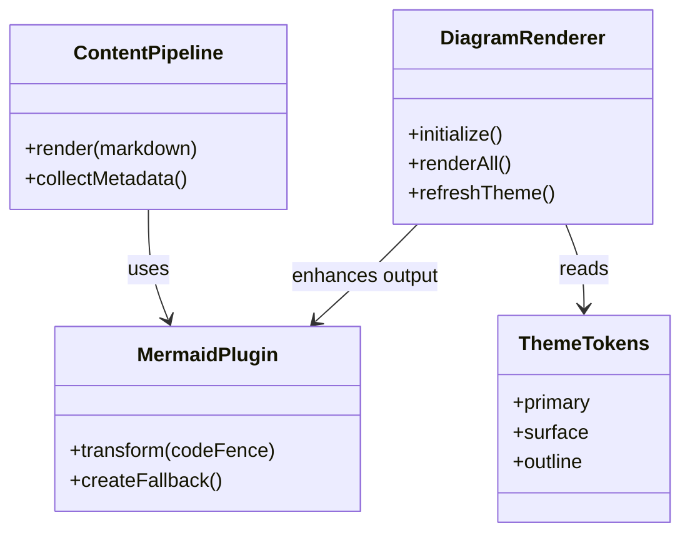

## 状态图

状态图用于呈现对象的生命周期，以及驱动它在不同状态间流转的事件。

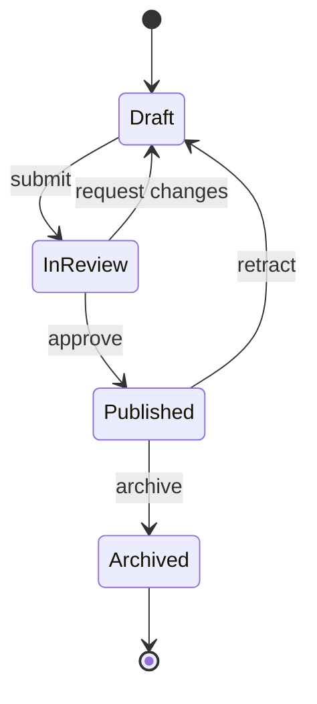

## XY 图表

XY 图表将柱状图与折线图结合在同一坐标轴上，便于比较数值与趋势。

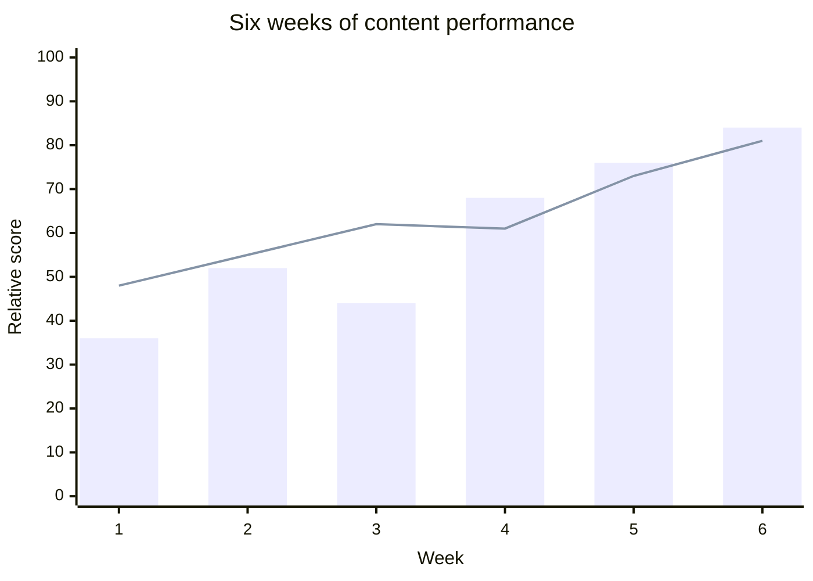

## 饼图

饼图以紧凑的方式直观比较各分类在整体中的占比。

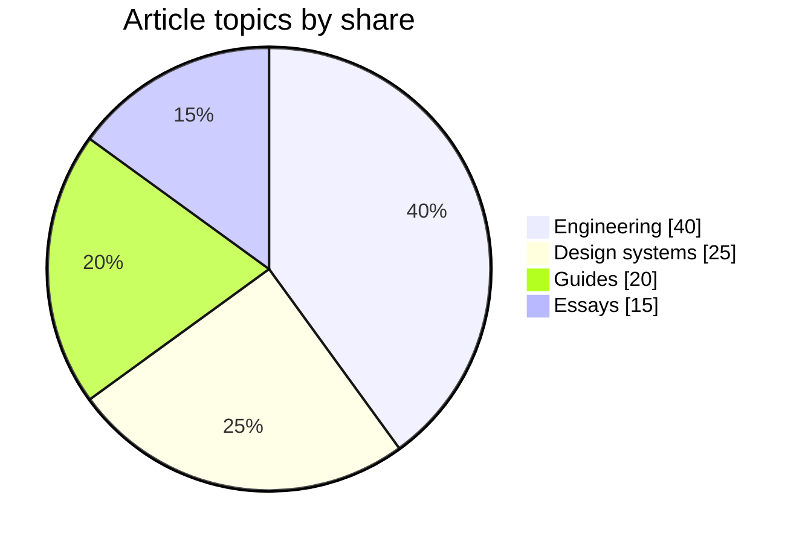

## 甘特图

甘特图将任务、依赖关系和里程碑沿日历时间线排列展示。

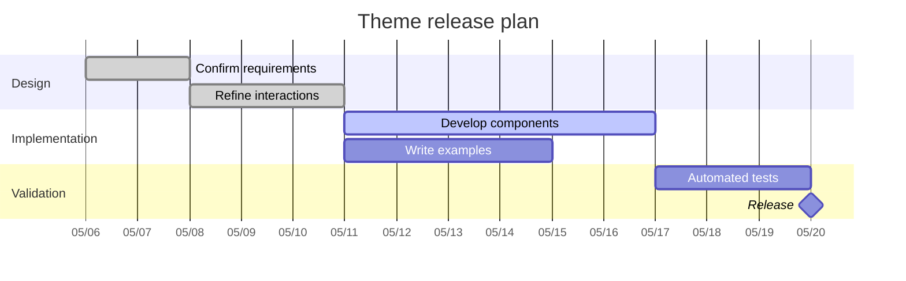

## 思维导图

思维导图围绕一个中心主题展开，扩展出相关的领域与支撑性概念。

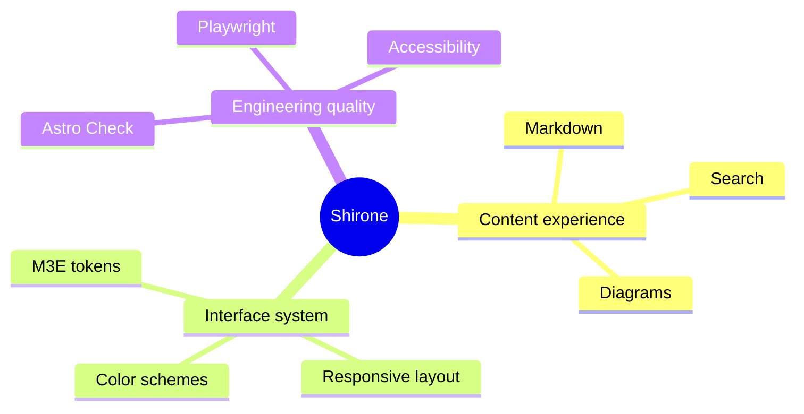

## 时间线

时间线用于概述重要的事件或阶段，无需提供精确的日历时长。

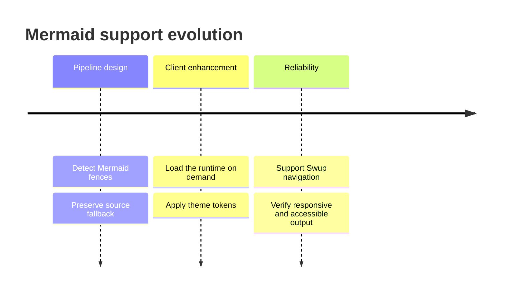

## 用户旅程图

用户旅程图将某个任务各阶段中的操作、参与方与体验评分整合在一起。

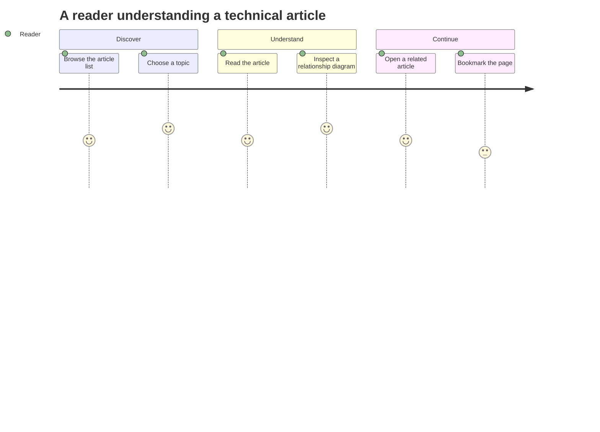

## Git 图

Git 图展示一个功能分支在被合并回主干之前，工作是如何逐步推进的。

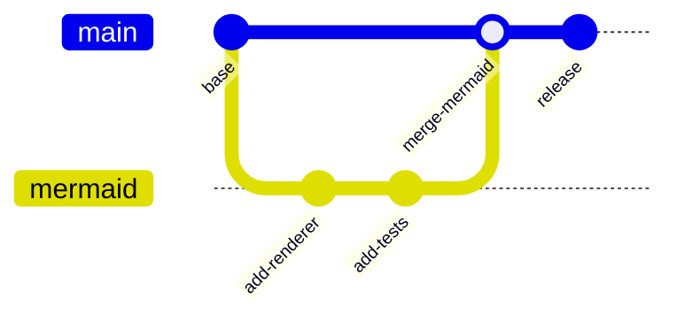

## 看板

看板按工作流状态对任务进行分组，让当前进度一目了然。

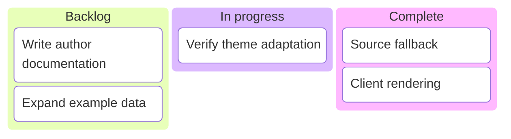

## 桑基图

桑基图通过连线的宽度来表现流量或其他数值在各节点之间的流动。

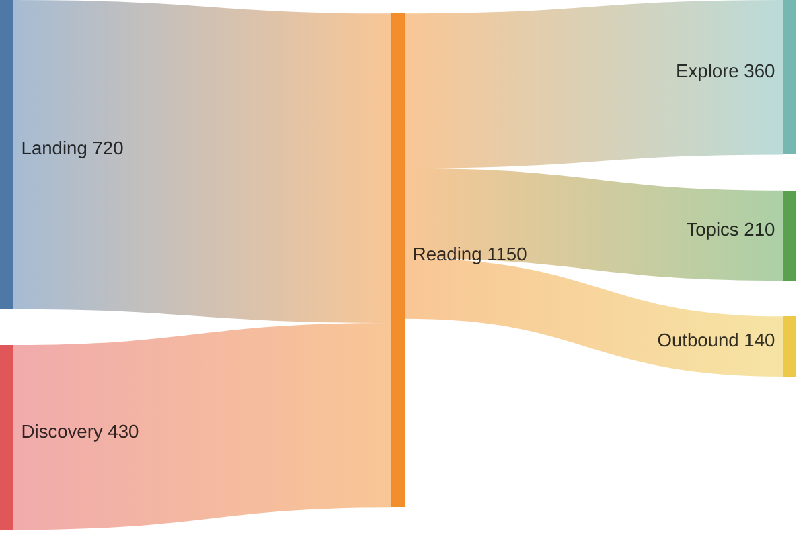

以上每个示例都使用标准的 `mermaid` 代码围栏。服务端会保留可读的源代码标记，浏览器再将其增强为跟随当前主题的 SVG。当主题切换，或通过 Swup 导航回到本文时，图表都会重新渲染。
